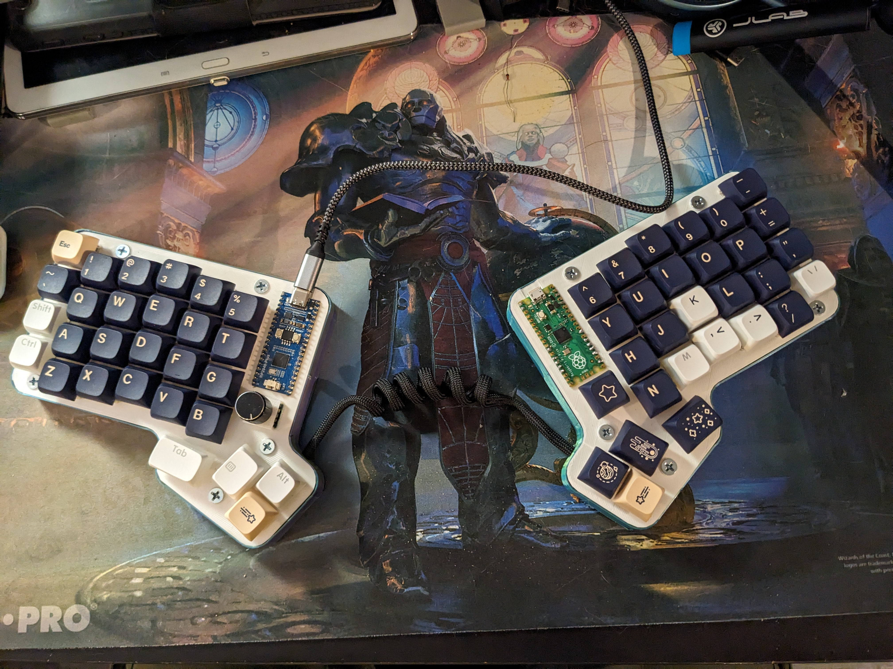

# split-keeb
Code and documentation for my custom built split keyboard.

## Materials

- [Keycaps](https://www.amazon.com/dp/B0BY46K915?psc=1&ref=ppx_yo2ov_dt_b_product_details)  25$
- [Switches](https://www.amazon.com/dp/B0BH1BF39S?ref=ppx_yo2ov_dt_b_product_details&th=1)  35$
- [Control Board (x2)](https://www.amazon.com/dp/B0C4YSX89L?psc=1&ref=ppx_yo2ov_dt_b_product_details) 13$
-[Header Pins](https://www.amazon.com/dp/B09F2NZ3GB?psc=1&ref=ppx_yo2ov_dt_b_product_details)   6$
- [Rotary Encoders (for the volume knob)](https://www.amazon.com/dp/B07F24TRYG?psc=1&ref=ppx_yo2ov_dt_b_product_details)    10$
- [Diodes](https://www.amazon.com/dp/B07Q4F3Y5W?psc=1&ref=ppx_yo2ov_dt_b_product_details)   6$

### Other
[3D printer filament](https://www.amazon.com/dp/B0C4YSX89L?psc=1&ref=ppx_yo2ov_dt_b_product_details)

## Tools
- 3D Printer
- Soldering Iron & Solder
- [Digital Calipers](https://www.amazon.com/dp/B07X8JQ8L5?psc=1&ref=ppx_yo2ov_dt_b_product_details)
- Wiring: I just recycled some old cat4/cat5 cables I had lying around
